# Hôtel Nova

**Nova Hotel** is a fictional website project developed with Django. It simulates a hotel's storefront with classic features: room presentation, reservations, contact information, etc.

## 🌟 Features

- [x] Showing **hotel rooms**
- [x] Presentation of the **menus** and **dishes offered**
- [x] **About** section presenting the history and management of the hotel
- [x] **Blog** section with culinary articles published by the hotel
- [x] **Contact form** for visitors to write to the hotel
- [x] **Newsletter subscription**: subscribers receive an email each time a new article is published
- [x] **Reservation form**: for visitors to make reservations
- [x] After a visitor sends a message via the contact form, **customer service agents** receive an email with the guest's information and their request
- [x] After an article is published, subscribers receive an email with information about the new article.
- [ ] No **registration** or **authentication** system.
- [ ] No **likes**, **comments**, or **view statistics** for articles.

---

## 🛠️ Technologies used

- Python / Django
- HTML / CSS
- Bootstrap
- SQLite 
- Django admin + unfold package for internal management

---

## 📝 Installation

```bash
git clone https://github.com/Franck-adjinon/Hotel-Website.git
cd Hotel-Website
python -m venv env
source env/bin/activate  # ou env\Scripts\activate sur Windows
pip install -r requirements.txt
python manage.py migrate
python manage.py runserver
```

---

## 🚀 Utilisation

Once the project is installed (see section [Installation](#installation)), Here's how to use it :

- Create an environment file in the project root and fill it with the information needed to manage email sending with Django, namely:

```bash
EMAIL_HOST_USER=votremail@gmail.com
EMAIL_HOST_PASSWORD=votre_mot_de_passe
EMAIL_BACKEND=django.core.mail.backends.smtp.EmailBackend
EMAIL_HOST=smtp.gmail.com
EMAIL_PORT=587
EMAIL_USE_TLS=True
```

⚠️ **Important:** Once the database is created with `python manage.py migrate`, you will need to **manually add data** (rooms, articles, testimonials, etc.) via the Django admin interface (`/admin`) so that the site pages display correctly.

You can also add some data by creating objects directly in the code or by importing a fixtures file if available.


- This is the conceptual data model that describes the structure of the database.:
  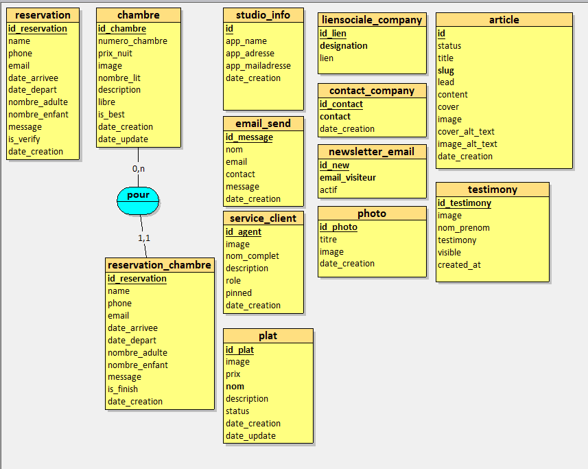

---

## 🖼️ Site Overview

- **Home**
  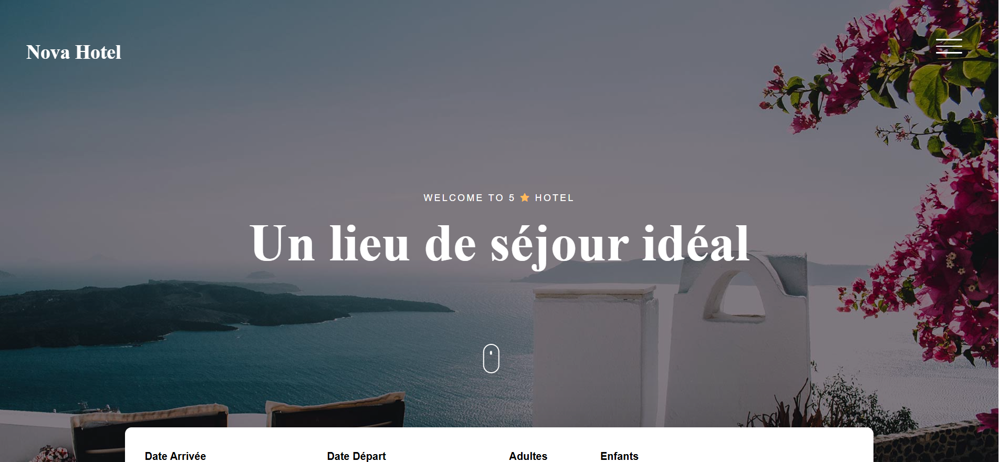

- **Rooms**
  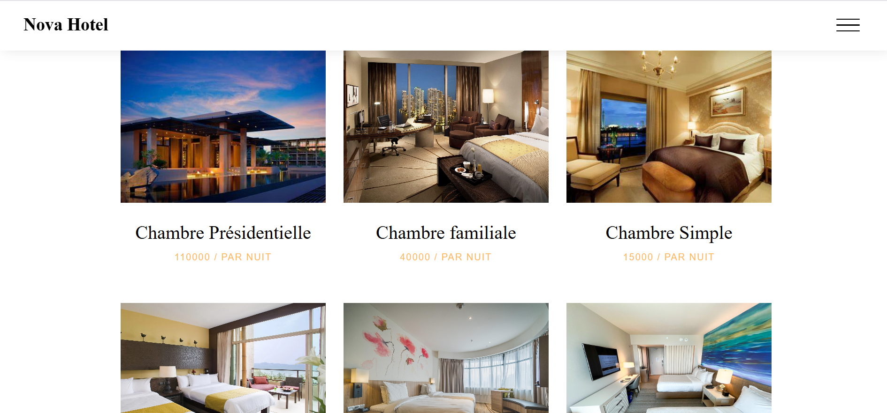

- **About**
  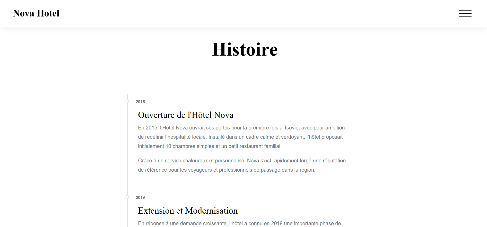

- **Blog**
  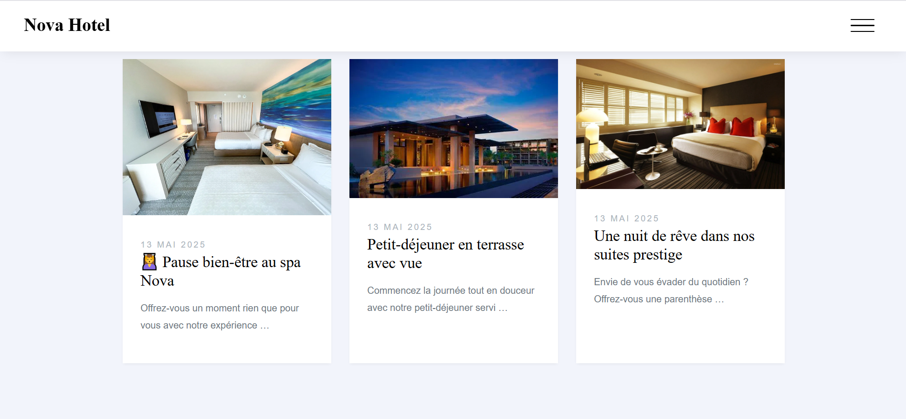

- **Contact**
  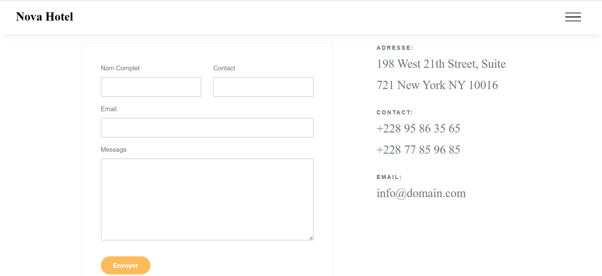

- **Reservation**
  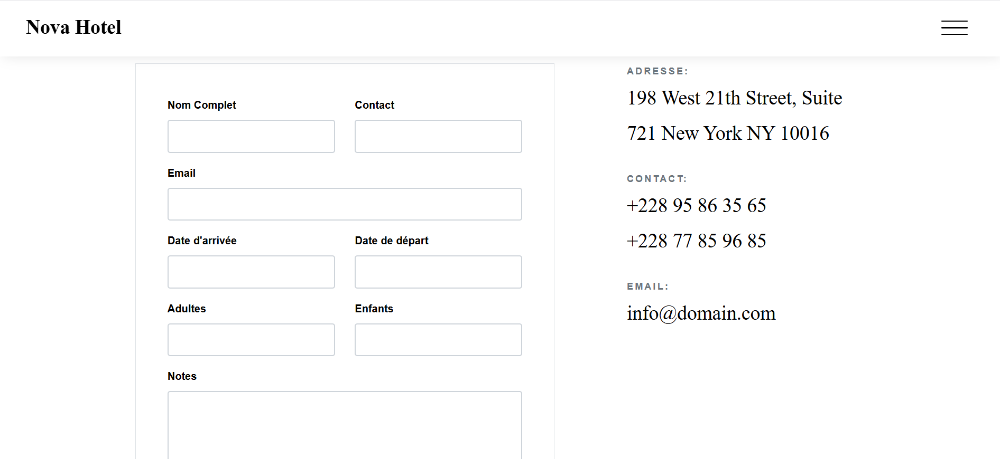

### Administration Section

- **Articles**  
  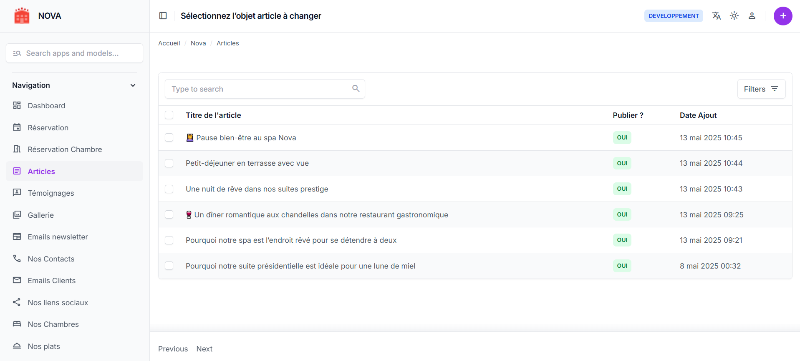

- **Rooms**  
  

- **Testimonials**  
  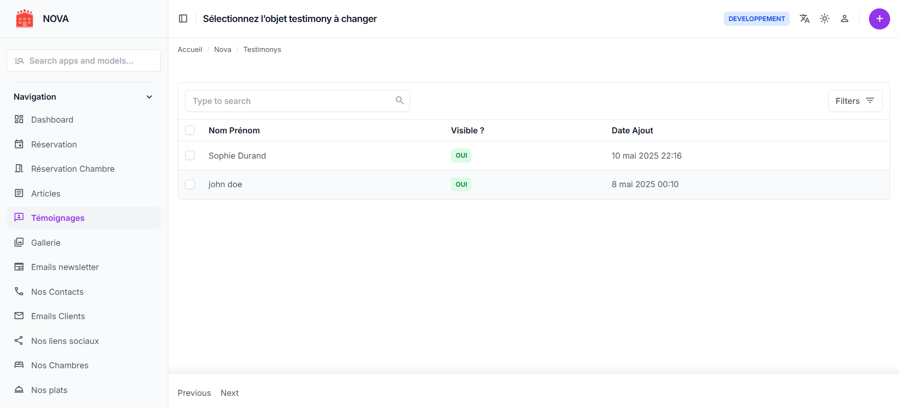

- **Reservations**  
  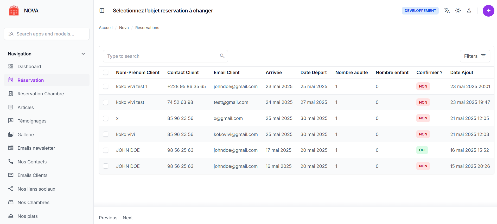

- **Galerie**  
  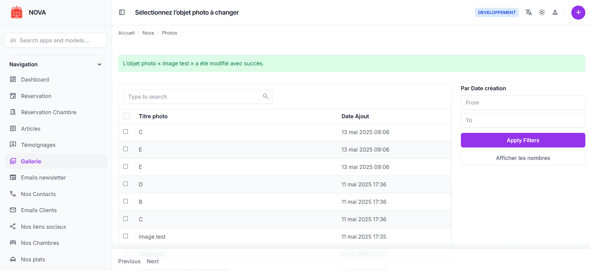

---

## 🔑 Access to the interface administration

- Admin url : `/admin`
- Default identifiers to test :  
  - **Username:** franck  
  - **Password:** franck4$

---

## 🤝 Contribute

Contributions are welcome! If you'd like to help improve this project, here's how you can contribute:

1. 🍴 Fork the project
2. 📥 Clone your fork locally
3. 🔧 Create a branch with a meaningful name (e.g., `git checkout -b correction-typo`)
4. 💡 Make your changes
5. ✅ Make sure everything works correctly
6. 📤 Push your changes and open a clear **pull request**

---

## 🐛 Trouvé un bug ?

If you find a bug or unexpected behavior, you can:

- 📩 Create an issue on [GitHub](https://github.com/Franck-adjinon/Hotel-Website.git/issues)
- 🔧 Submit a pull request with a proposed fix
- 💬 Or simply contact me via [email](mailto:franckadjinon@gmail.com)

---

## 📄 Licence

This project is open source software distributed under the **MIT** License.
You are free to use, modify, and distribute it, provided you retain the original copyright notices and license.

See the [LICENSE](./LICENSE) file for more information.

---

## 🙏 Credits

Design by [Colorlib](https://colorlib.com/) 
